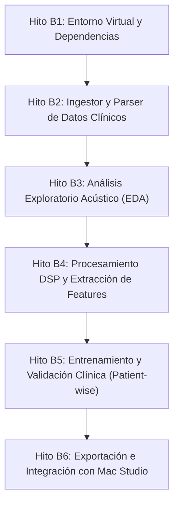

# PLAN INICIAL DE IMPLEMENTACIÓN: BLOQUE B (CIENCIA DE DATOS E INTELIGENCIA ARTIFICIAL)
> **Rol:** Especialista en Tratamiento de Señales Biomédicas, Feature Engineering y Modelado Clínico  
> **Proyecto:** Sistema Embebido para Captura y Análisis de Señales Cardiorrespiratorias (*f tecno* - 8vo Semestre 2026)  
> **Fecha de creación:** Octubre 2026  
> **Estado:** Aprobado para ejecución  

---

## 1. Visión y Objetivo del Bloque B

El propósito de este bloque es construir el **"Cerebro Clínico"** del proyecto. Mientras que el hardware (ESP32 + INMP441 + MAX30102) se encarga de digitalizar las señales acústicas y ópticas, el Bloque B se encarga de:
1. **Curar, sincronizar y estructurar** las bases de datos de referencia (ICBHI 2017 y PhysioNet 2016).
2. **Procesar digitalmente las señales acústicas** (filtrado Butterworth, remuestreo a 16 kHz y segmentación de ciclos).
3. **Extraer características acústicas matemáticamente relevantes** (MFCCs, espectrogramas Mel, energía RMS, ZCR, centroide espectral).
4. **Entrenar y validar modelos de Machine Learning** con rigor clínico (evaluando Sensibilidad, Especificidad e ICBHI Score, sin *data leakage* por paciente).
5. **Exportar y conectar los modelos entrenados** hacia el backend central (`ai_engine.py` en la Apple Mac Studio remota) para clasificar auscultaciones en tiempo real durante la feria.

---

## 2. Arquitectura de Archivos y Módulos de Software

Para asegurar un desarrollo limpio, profesional y reproducible, el código del Bloque B se organizará en la siguiente estructura modular:

```
code/
├── data/                                 # Datasets crudos y organizados
│   ├── ICBHI_organizado - pacientes de los links filtrados/ # 16 categorías cruzadas (126 pacientes)
│   ├── training/                         # PhysioNet 2016 Training (3,240 audios PCG)
│   ├── validation - pruebas realizadas/  # PhysioNet 2016 Validation (301 audios PCG)
│   └── ICBHI_2017_pacientes_filtrable_1.xlsx # Metadatos clínicos de los 126 pacientes
├── notebooks/                            # Cuadernos de experimentación rápida y visualización
│   ├── 01_exploracion_audio_eda.ipynb    # Formas de onda, FFT y espectrogramas Mel
│   ├── 02_extraccion_caracteristicas.ipynb # Pipeline tabular interactivo
│   └── 03_entrenamiento_clasificador.ipynb # Modelado, matrices de confusión y curvas ROC
├── src/                                  # Librería modular en Python (producción)
│   ├── __init__.py
│   ├── data_loader.py                    # Parser de fichas CSV, audios .wav y anotaciones .txt
│   ├── audio_processing.py               # Remuestreo (16 kHz), filtro paso-banda, segmentación
│   ├── feature_extraction.py             # Extracción de MFCCs, RMS, ZCR, centroides
│   ├── train.py                          # Script de entrenamiento por línea de comandos
│   └── evaluate.py                       # Cálculo de Sensibilidad, Especificidad e ICBHI Score
├── models/                               # Pesos de modelos serializados (.pkl, .joblib, .onnx)
│   └── .gitkeep
├── requirements.txt                      # Dependencias fijadas para el entorno Python
└── docs/
    └── PLAN_INICIAL_DATOS_IA.md          # Este plan de implementación
```

---

## 3. Desglose de Hitos de Implementación (Paso a Paso)



---

### Hito B1: Preparación del Entorno Virtual de Desarrollo
* **Objetivo:** Disponer de un entorno aislado de Python con todas las librerías científicas y de audio instaladas.
* **Actividades:**
  1. Crear un entorno virtual local (`.venv`) en la raíz del proyecto.
  2. Instalar las dependencias listadas en [requirements.txt](file:///Users/wilsonjonatan/Documents/8vo%202026/f%20tecno/code/requirements.txt) (`librosa`, `scipy`, `numpy`, `pandas`, `scikit-learn`, `matplotlib`, `seaborn`).
  3. Verificar que `librosa` y `soundfile` decodifiquen correctamente archivos `.wav` de 16 y 24 bits.
* **Entregable:** Entorno funcional probado con un script de verificación de importaciones.

---

### Hito B2: Ingestor y Lector Modular de Datos (`src/data_loader.py`)
* **Objetivo:** Proveer funciones reutilizables que indexen todos los audios y etiquetas de ICBHI y PhysioNet en DataFrames estructurados.
* **Actividades:**
  1. **Indexador de ICBHI:** Recorrer las 16 categorías de [ICBHI_organizado - pacientes de los links filtrados](file:///Users/wilsonjonatan/Documents/8vo%202026/f%20tecno/code/data/ICBHI_organizado%20-%20pacientes%20de%20los%20links%20filtrados/) e indexar los 920 archivos `.wav` y `.txt`.
  2. **Parser de Ciclos Respiratorios:** Leer las 4 columnas de cada `.txt`:
     * `Inicio (s)`, `Fin (s)`, `Crepitantes (0/1)`, `Sibilancias (0/1)`.
  3. **Mapeo de Clases Clínicas:**
     * `0`: Normal (Sin crepitantes ni sibilancias).
     * `1`: Solo Crepitantes (*Crackles*).
     * `2`: Solo Sibilancias (*Wheezes*).
     * `3`: Ambos (*Both*).
  4. **Metadatos de Paciente:** Asociar edad, sexo, IMC y diagnóstico general provenientes de [ICBHI_2017_pacientes_filtrable_1.xlsx](file:///Users/wilsonjonatan/Documents/8vo%202026/f%20tecno/code/data/ICBHI_2017_pacientes_filtrable_1.xlsx).
* **Entregable:** Módulo `src/data_loader.py` capaz de retornar un DataFrame con metadata y referencias exactas a cada ciclo respiratorio.

---

### Hito B3: Análisis Exploratorio de Datos Acústico (EDA) (`notebooks/01_exploracion_audio_eda.ipynb`)
* **Objetivo:** Comprender las diferencias físicas y espectrales entre sonidos pulmonares normales y patológicos.
* **Actividades:**
  1. **Visualización en el Dominio del Tiempo:** Graficar la forma de onda de un ciclo normal vs. un ciclo con crepitantes (impulsos breves discontinuos) y uno con sibilancias (oscilaciones sinusoidales continuas).
  2. **Visualización en el Dominio de la Frecuencia (FFT y Densidad Espectral de Potencia PSD):** Observar el rango de frecuencias dominante (100 Hz a 1500 Hz).
  3. **Espectrogramas Mel:** Generar representaciones tiempo-frecuencia en escala perceptual Mel (`n_mels=64` o `128`) evidenciando las bandas armónicas de las sibilancias y la energía explosiva de los crepitantes.
  4. **Distribución y Balance de Clases:** Generar gráficos de barras con el número de ciclos normales vs patológicos por paciente y por patología (EPOC, Neumonía, Asma).
* **Entregable:** Cuaderno interactivo documentado con figuras comparativas de alta calidad médica.

---

### Hito B4: Acondicionamiento de Señal y Extracción de Características (`src/audio_processing.py` y `src/feature_extraction.py`)
* **Objetivo:** Transformar el audio crudo en un vector numérico estructurado listo para algoritmos de Machine Learning.
* **Actividades:**
  1. **Remuestreo Estandarizado:** Convertir cualquier audio a **$16\,000\text{ Hz}$** (frecuencia nativa de muestreo del micrófono físico INMP441 en el ESP32).
  2. **Filtrado Digital:** Implementar filtro paso-banda Butterworth (Orden 4, de **$100\text{ Hz} \text{ a } 2000\text{ Hz}$**) para suprimir artefactos de roce mecánico (<50 Hz) y ruido eléctrico.
  3. **Segmentación y Padding:** Recortar cada ciclo respiratorio individual según los timestamps. Aplicar relleno con ceros (*zero-padding*) o recorte a una longitud estándar de **$4.0\text{ segundos}$** (64,000 muestras a 16 kHz).
  4. **Vector de Características Tabulares:**
     * **MFCCs:** 13 a 20 coeficientes cepstrales Mel (calculando media, desviación estándar, delta y delta-delta = $\sim 40-60$ variables).
     * **Energía RMS:** Nivel de potencia acústica del ciclo.
     * **Tasa de Cruces por Cero (ZCR):** Detección de frecuencias altas y turbulencia.
     * **Centroide Espectral y Spectral Roll-off:** Localización del centro de masa espectral.
* **Entregable:** Script `src/feature_extraction.py` que procesa el dataset y genera un archivo `data/features_icbhi.csv` o `data/features_icbhi.parquet`.

---

### Hito B5: Entrenamiento y Validación Clínica sin Data Leakage (`src/train.py` y `src/evaluate.py`)
* **Objetivo:** Entrenar un clasificador robusto, confiable y médicamente evaluado.
* **Actividades:**
  1. **Partición Estricta por Paciente (*Patient-wise Split*):**
     * **Regla Inquebrantable:** Todos los ciclos de un paciente específico deben pertenecer **exclusivamente** al conjunto de entrenamiento o al de validación/prueba. Nunca mezclar ciclos del mismo paciente entre particiones.
     * Utilizar el split oficial de ICBHI (60% Train / 40% Test) o `GroupKFold(n_splits=5, groups=patient_id)`.
  2. **Modelos de Clasificación Línea Base (ML Tradicional):**
     * **Random Forest:** Modelo no lineal robusto con balanceo de pesos (`class_weight='balanced'`).
     * **Support Vector Machine (SVM):** Con kernel RBF normalizado.
     * **Gradient Boosting (LightGBM o XGBoost):** Para optimizar la frontera de decisión.
  3. **Métricas Clínicas Obligatorias:**
     * Sensibilidad ($Se = \frac{TP}{TP+FN}$): Capacidad de detectar anomalías.
     * Especificidad ($Sp = \frac{TN}{TN+FP}$): Capacidad de confirmar pacientes sanos.
     * **Score Oficial ICBHI:** $\text{Score} = \frac{Se + Sp}{2}$.
     * Matriz de confusión normalizada por clases y F1-score macro.
* **Entregable:** Modelo entrenado con métricas reportadas y guardado en `models/clasificador_respiratorio.joblib`.

---

### Hito B6: Serialización e Integración con Servidor Mac Studio (`models/` y `Backend/ai_engine.py`)
* **Objetivo:** Conectar el modelo entrenado con el backend de producción.
* **Actividades:**
  1. Exportar el pipeline completo (escalador StandardScaler + clasificador) en formato portable (`.joblib` o formato ONNX).
  2. Conectar la función de inferencia en `Backend/ai_engine.py` de la Mac Studio:
     * Cuando el backend reciba un paquete de audio o características desde el gateway, llamará a este modelo para generar la etiqueta diagnóstica (Normal, Crepitantes, Sibilancias o Ambos).
  3. Enriquecer el prompt del asistente LLM (Ollama LLaMA 3.2 3B) con la predicción del modelo para que la explicación al usuario sea médicamente coherente.
* **Entregable:** Demostración de inferencia en vivo con audios de prueba comunicados con FastAPI.

---

## 4. Cronograma Sugerido de Ejecución

| Semana / Sesión | Hito | Tarea Principal |
| :--- | :--- | :--- |
| **Sesión 1 (Hoy)** | **Hito B1 & B2** | Crear entorno virtual, instalar dependencias y construir `src/data_loader.py`. |
| **Sesión 2** | **Hito B3** | Cuaderno EDA acústico: formas de onda, espectrogramas y patrones de sibilancias/crepitantes. |
| **Sesión 3** | **Hito B4** | Pipeline de filtrado y extracción de características (`src/feature_extraction.py`). |
| **Sesión 4** | **Hito B5** | Entrenamiento del clasificador Random Forest / SVM con métricas clínicas y validación *patient-wise*. |
| **Sesión 5** | **Hito B6** | Exportar modelo hacia la Mac Studio e integrarlo con `Backend/ai_engine.py` y Ollama. |
